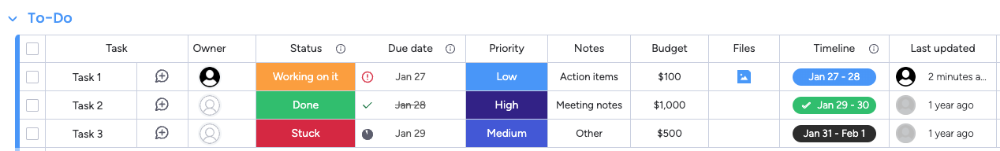

# mondantic


Converts from Monday.com boards to Pydantic dataclasses.

## Installation

``` bash
pip install git+https://github.com/WEHI-ResearchComputing/mondantic.git
```

## Usage

Let’s say we’re working with the following demo board: 

### Schema Generation

The first step is to generate the Pydantic schema. This is most easily
done using the CLI:

``` python
! mondantic-codegen --board-id "{board}" --api-key "{api_key}" > models.py
```

Which generates:

``` python
from mondantic.schema import MirrorValue, NumbersValue, BoardRelationValue, ButtonValue, CheckboxValue, ColorPickerValue, CountryValue, CreationLogValue, DateValue, DependencyValue, DocValue, DropdownValue, EmailValue, FileValue, FormulaValue, HourValue, IntegrationValue, ItemIdValue, ItemIdValue, LastUpdatedValue, LinkValue, LocationValue, PeopleValue, PersonValue, PhoneValue, ProgressValue, RatingValue, StatusValue, SubtasksValue, TagsValue, TeamValue, TextValue, TimeTrackingValue, TimelineValue, UnsupportedValue, VoteValue, WeekValue, WorldClockValue, ColumnValue
from pydantic import BaseModel, Field
from typing import ClassVar, Optional

class TestBoard(BaseModel):
    board_name: ClassVar[str] = 'Test Board'
    board_id: ClassVar[str] = '1964053908'
    name: Optional[ColumnValue] = Field(alias='name', default=None)
    owner: Optional[PeopleValue] = Field(alias='project_owner', default=None)
    status: Optional[StatusValue] = Field(alias='project_status', default=None)
    due_date: Optional[DateValue] = Field(alias='date', default=None)
    priority: Optional[StatusValue] = Field(alias='priority_1', default=None)
    notes: Optional[TextValue] = Field(alias='text9', default=None)
    budget: Optional[NumbersValue] = Field(alias='numbers', default=None)
    files: Optional[FileValue] = Field(alias='files_1', default=None)
    timeline: Optional[TimelineValue] = Field(alias='project_timeline', default=None)
    last_updated: Optional[LastUpdatedValue] = Field(alias='last_updated', default=None)
```

## Hydration

Then, you can create instances of these models in Python. Note that each
column contains nested data classes, hence the long output!

``` python
from mondantic import hydrate
from devtools import pprint

for instance in hydrate(TestBoard, api_key):
    pprint(instance)
```

    TestBoard(
        name=None,
        owner=PeopleValue(
            board_id=None,
            column=None,
            id='project_owner',
            item_id=None,
            text='Michael Milton',
            type=<ColumnType.people: 'people'>,
            value='{"changed_at":"2023-08-23T12:42:09.066Z","personsAndTeams":[{"id":71461327,"kind":"person"}]}',
            typename__='PeopleValue',
            persons_and_teams=[
                PeopleEntity(
                    id='71461327',
                    kind=<Kind.person: 'person'>,
                    typename__='PeopleEntity',
                ),
            ],
            updated_at='2023-08-23T12:42:09+00:00',
        ),
        status=StatusValue(
            board_id=None,
            column=None,
            id='project_status',
            item_id=None,
            text='Working on it',
            type=<ColumnType.status: 'status'>,
            value='{"index":0,"post_id":null,"changed_at":"2023-03-06T14:43:16.460Z"}',
            typename__='StatusValue',
            index=0,
            is_done=False,
            label='Working on it',
            label_style=StatusLabelStyle(
                border='#e99729',
                color='#fdab3d',
                typename__='StatusLabelStyle',
            ),
            update_id=None,
            updated_at='2023-03-06T14:43:16+00:00',
        ),
        due_date=DateValue(
            board_id=None,
            column=None,
            id='date',
            item_id=None,
            text='2025-01-27',
            type=<ColumnType.date: 'date'>,
            value='{"date":"2025-01-27","changed_at":"2023-11-08T17:42:20.136Z"}',
            typename__='DateValue',
            date='2025-01-27',
            icon=None,
            time='',
            updated_at='2023-11-08T17:42:20+00:00',
        ),
        priority=StatusValue(
            board_id=None,
            column=None,
            id='priority_1',
            item_id=None,
            text='Low',
            type=<ColumnType.status: 'status'>,
            value='{"index":7,"post_id":null,"changed_at":"2024-05-20T13:24:07.833Z"}',
            typename__='StatusValue',
            index=7,
            is_done=False,
            label='Low',
            label_style=StatusLabelStyle(
                border='#4387e8',
                color='#579bfc',
                typename__='StatusLabelStyle',
            ),
            update_id=None,
            updated_at='2024-05-20T13:24:07+00:00',
        ),
        notes=TextValue(
            board_id=None,
            column=None,
            id='text9',
            item_id=None,
            text='Action items',
            type=<ColumnType.text: 'text'>,
            value='"Action items"',
            typename__='TextValue',
        ),
        budget=NumbersValue(
            board_id=None,
            column=None,
            id='numbers',
            item_id=None,
            text='100',
            type=<ColumnType.numbers: 'numbers'>,
            value='"100"',
            typename__='NumbersValue',
            direction=<NumberValueUnitDirection.left: 'left'>,
            number=100.0,
            symbol='$',
        ),
        files=FileValue(
            board_id=None,
            column=None,
            id='files_1',
            item_id=None,
            text='https://ttmigueltts-team.monday.com/protected_static/27704998/resources/22109573/file.png',
            type=<ColumnType.file: 'file'>,
            value=(
                '{"files":[{"name":"file.png","assetId":22109573,"isImage":"true","fileType":"ASSET","createdAt":170730029'
                '4860,"createdBy":"40202275"}]}'
            ),
            typename__='FileValue',
            files=[
                FileAssetValue(
                    asset=None,
                    asset_id=None,
                    created_at=None,
                    creator=None,
                    creator_id=None,
                    is_image=None,
                    name=None,
                    typename__='FileAssetValue',
                ),
            ],
        ),
        timeline=TimelineValue(
            board_id=None,
            column=None,
            id='project_timeline',
            item_id=None,
            text='2025-01-27 - 2025-01-28',
            type=<ColumnType.timeline: 'timeline'>,
            value='{"to":"2025-01-28","from":"2025-01-27","changed_at":"2023-11-08T17:42:33.310Z"}',
            typename__='TimelineValue',
            from_=None,
            to='2025-01-28T00:00:00+00:00',
            updated_at='2023-11-08T17:42:33+00:00',
            visualization_type=None,
        ),
        last_updated=LastUpdatedValue(
            board_id=None,
            column=None,
            id='last_updated',
            item_id=None,
            text='2025-01-28 00:43:17 UTC',
            type=<ColumnType.last_updated: 'last_updated'>,
            value='{"updated_at":"2025-01-28T00:43:17Z","updater_id":"71461327"}',
            typename__='LastUpdatedValue',
            updated_at='2025-01-28T00:43:17Z',
            updater=None,
            updater_id=None,
        ),
    )
    TestBoard(
        name=None,
        owner=PeopleValue(
            board_id=None,
            column=None,
            id='project_owner',
            item_id=None,
            text='',
            type=<ColumnType.people: 'people'>,
            value=None,
            typename__='PeopleValue',
            persons_and_teams=[],
            updated_at=None,
        ),
        status=StatusValue(
            board_id=None,
            column=None,
            id='project_status',
            item_id=None,
            text='Done',
            type=<ColumnType.status: 'status'>,
            value='{"index":1,"post_id":null,"changed_at":"2023-04-27T16:16:13.187Z"}',
            typename__='StatusValue',
            index=1,
            is_done=True,
            label='Done',
            label_style=StatusLabelStyle(
                border='#00b461',
                color='#00c875',
                typename__='StatusLabelStyle',
            ),
            update_id=None,
            updated_at='2023-04-27T16:16:13+00:00',
        ),
        due_date=DateValue(
            board_id=None,
            column=None,
            id='date',
            item_id=None,
            text='2025-01-28',
            type=<ColumnType.date: 'date'>,
            value='{"date":"2025-01-28","changed_at":"2023-11-08T17:42:23.641Z"}',
            typename__='DateValue',
            date='2025-01-28',
            icon=None,
            time='',
            updated_at='2023-11-08T17:42:23+00:00',
        ),
        priority=StatusValue(
            board_id=None,
            column=None,
            id='priority_1',
            item_id=None,
            text='High',
            type=<ColumnType.status: 'status'>,
            value='{"index":110,"post_id":null,"changed_at":"2023-06-25T13:33:11.844Z"}',
            typename__='StatusValue',
            index=110,
            is_done=False,
            label='High',
            label_style=StatusLabelStyle(
                border='#401694',
                color='#401694',
                typename__='StatusLabelStyle',
            ),
            update_id=None,
            updated_at='2023-06-25T13:33:11+00:00',
        ),
        notes=TextValue(
            board_id=None,
            column=None,
            id='text9',
            item_id=None,
            text='Meeting notes',
            type=<ColumnType.text: 'text'>,
            value='"Meeting notes"',
            typename__='TextValue',
        ),
        budget=NumbersValue(
            board_id=None,
            column=None,
            id='numbers',
            item_id=None,
            text='1000',
            type=<ColumnType.numbers: 'numbers'>,
            value='"1000"',
            typename__='NumbersValue',
            direction=<NumberValueUnitDirection.left: 'left'>,
            number=1000.0,
            symbol='$',
        ),
        files=FileValue(
            board_id=None,
            column=None,
            id='files_1',
            item_id=None,
            text='',
            type=<ColumnType.file: 'file'>,
            value=None,
            typename__='FileValue',
            files=[],
        ),
        timeline=TimelineValue(
            board_id=None,
            column=None,
            id='project_timeline',
            item_id=None,
            text='2025-01-29 - 2025-01-30',
            type=<ColumnType.timeline: 'timeline'>,
            value='{"to":"2025-01-30","from":"2025-01-29","changed_at":"2023-11-08T17:42:36.884Z"}',
            typename__='TimelineValue',
            from_=None,
            to='2025-01-30T00:00:00+00:00',
            updated_at='2023-11-08T17:42:36+00:00',
            visualization_type=None,
        ),
        last_updated=LastUpdatedValue(
            board_id=None,
            column=None,
            id='last_updated',
            item_id=None,
            text='2023-11-08 18:30:36 UTC',
            type=<ColumnType.last_updated: 'last_updated'>,
            value='{"updated_at":"2023-11-08T18:30:36Z","updater_id":"40202275"}',
            typename__='LastUpdatedValue',
            updated_at='2023-11-08T18:30:36Z',
            updater=None,
            updater_id=None,
        ),
    )
    TestBoard(
        name=None,
        owner=PeopleValue(
            board_id=None,
            column=None,
            id='project_owner',
            item_id=None,
            text='',
            type=<ColumnType.people: 'people'>,
            value=None,
            typename__='PeopleValue',
            persons_and_teams=[],
            updated_at=None,
        ),
        status=StatusValue(
            board_id=None,
            column=None,
            id='project_status',
            item_id=None,
            text='Stuck',
            type=<ColumnType.status: 'status'>,
            value='{"index":2,"post_id":null,"changed_at":"2023-04-27T16:17:50.181Z"}',
            typename__='StatusValue',
            index=2,
            is_done=False,
            label='Stuck',
            label_style=StatusLabelStyle(
                border='#ce3048',
                color='#df2f4a',
                typename__='StatusLabelStyle',
            ),
            update_id=None,
            updated_at='2023-04-27T16:17:50+00:00',
        ),
        due_date=DateValue(
            board_id=None,
            column=None,
            id='date',
            item_id=None,
            text='2025-01-29',
            type=<ColumnType.date: 'date'>,
            value='{"date":"2025-01-29","changed_at":"2023-11-08T17:43:01.765Z"}',
            typename__='DateValue',
            date='2025-01-29',
            icon=None,
            time='',
            updated_at='2023-11-08T17:43:01+00:00',
        ),
        priority=StatusValue(
            board_id=None,
            column=None,
            id='priority_1',
            item_id=None,
            text='Medium',
            type=<ColumnType.status: 'status'>,
            value='{"index":109,"post_id":null,"changed_at":"2023-05-23T11:17:32.308Z"}',
            typename__='StatusValue',
            index=109,
            is_done=False,
            label='Medium',
            label_style=StatusLabelStyle(
                border='#5559df',
                color='#5559df',
                typename__='StatusLabelStyle',
            ),
            update_id=None,
            updated_at='2023-05-23T11:17:32+00:00',
        ),
        notes=TextValue(
            board_id=None,
            column=None,
            id='text9',
            item_id=None,
            text='Other',
            type=<ColumnType.text: 'text'>,
            value='"Other"',
            typename__='TextValue',
        ),
        budget=NumbersValue(
            board_id=None,
            column=None,
            id='numbers',
            item_id=None,
            text='500',
            type=<ColumnType.numbers: 'numbers'>,
            value='"500"',
            typename__='NumbersValue',
            direction=<NumberValueUnitDirection.left: 'left'>,
            number=500.0,
            symbol='$',
        ),
        files=FileValue(
            board_id=None,
            column=None,
            id='files_1',
            item_id=None,
            text='',
            type=<ColumnType.file: 'file'>,
            value=None,
            typename__='FileValue',
            files=[],
        ),
        timeline=TimelineValue(
            board_id=None,
            column=None,
            id='project_timeline',
            item_id=None,
            text='2025-01-31 - 2025-02-01',
            type=<ColumnType.timeline: 'timeline'>,
            value='{"to":"2025-02-01","from":"2025-01-31","changed_at":"2023-11-08T17:42:46.231Z"}',
            typename__='TimelineValue',
            from_=None,
            to='2025-02-01T00:00:00+00:00',
            updated_at='2023-11-08T17:42:46+00:00',
            visualization_type=None,
        ),
        last_updated=LastUpdatedValue(
            board_id=None,
            column=None,
            id='last_updated',
            item_id=None,
            text='2023-11-08 18:30:39 UTC',
            type=<ColumnType.last_updated: 'last_updated'>,
            value='{"updated_at":"2023-11-08T18:30:39Z","updater_id":"40202275"}',
            typename__='LastUpdatedValue',
            updated_at='2023-11-08T18:30:39Z',
            updater=None,
            updater_id=None,
        ),
    )
